# Titanic Dataset Exploratory Data Analysis (EDA)

This analysis explores the **Titanic dataset**, a historical dataset detailing passengers aboard the ill-fated RMS Titanic. The dataset provides various passenger details such as age, sex, class, survival status, and more. The aim of this exploratory analysis is to uncover patterns and relationships within the data, especially those influencing passenger survival.

## Initial Dataset Overview

The Titanic dataset initially contains **1309 rows** and **14 columns** with the following features:

- **pclass:** Passenger Class (1 = 1st, 2 = 2nd, 3 = 3rd)
- **survived:** Survival (0 = No, 1 = Yes)
- **name:** Passenger Name
- **sex:** Gender (male/female)
- **age:** Age
- **sibsp:** Number of Siblings/Spouse Aboard
- **parch:** Number of Parents/Children Aboard
- **ticket:** Ticket Number
- **fare:** Fare
- **cabin:** Cabin Number
- **embarked:** Port of Embarkation (C = Cherbourg, Q = Queenstown, S = Southampton)
- **boat:** Lifeboat (if survived)
- **body:** Body Number (if not survived and body is recovered)
- **home.dest:** Home Destination

## Data Cleaning

The dataset underwent several data cleaning steps to ensure meaningful analysis:

- **Column Removal:**  
  Irrelevant columns for this analysis, including `name`, `ticket`, `cabin`, `embarked`, `boat`, `body`, and `home.dest`, were removed to simplify the dataset.

- **Handling Missing Values:**  
  - Missing `age` values were filled with the median age for the respective gender.
  - Missing `fare` values were filled with the mean fare for the respective passenger class.

- **Duplicate Records:**  
  Duplicate records were identified and removed to ensure data consistency.

- **Outlier Detection:**  
  Outliers in the `fare` and `age` columns were examined using box plots. While outliers were present, they were retained as they represent real-world extremes (e.g., extremely wealthy passengers or very elderly individuals), which could potentially offer valuable insights into survival patterns.

- **Feature Engineering:**  
  The `sibsp` and `parch` columns were combined into a new feature named `is_alone`, indicating whether a passenger was travelling alone.

After these steps, the dataset was reduced to **1100 rows** and **6 columns**.

## Univariate Analysis

### 1. **Age Distribution:**

- **Mean:** 29.8  
- **Median:** 28.0  
- **Standard Deviation:** 13.88  
- **Skewness:** 0.45 (slightly right-skewed)  
- **Kurtosis:** 0.44

The age distribution is right-skewed, indicating that more younger passengers were aboard compared to older passengers.

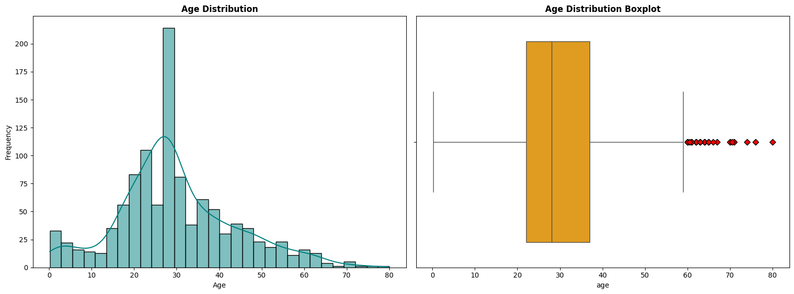

### 2. **Fare Distribution:**

- **Mean:** 36.93  
- **Median:** 16.1  
- **Standard Deviation:** 55.31  
- **Skewness:** 4.07 (highly right-skewed)  
- **Kurtosis:** 23.31

The fare distribution is highly right-skewed, with a larger portion of passengers paying low fares, while a small group paid significantly higher fares.

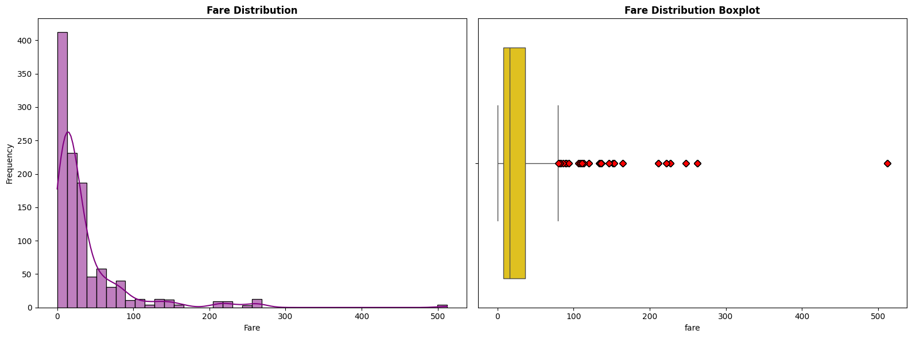

### 3. **Gender Distribution:**

- **Male Passengers:** 428  
- **Female Passengers:** 672

More female passengers were aboard than male passengers.

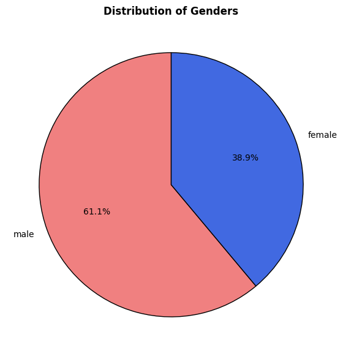

### 4. **Passenger Class Distribution:**

- **1st Class:** 312  
- **2nd Class:** 241  
- **3rd Class:** 547

Most passengers were in 3rd class, with a smaller proportion in 1st and 2nd class.

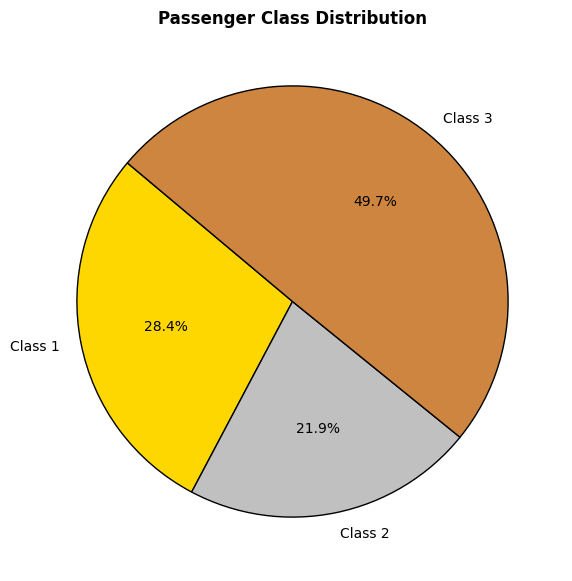

### 5. **Survival Analysis:**

- **Survived:** 464 passengers  
- **Did not Survive:** 636 passengers

42.2% of passengers survived, while the majority perished.

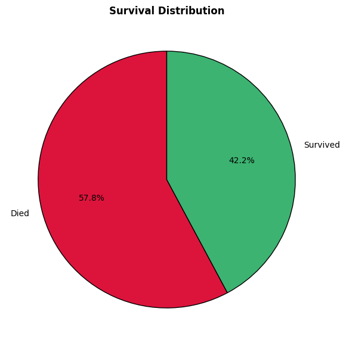

### 6. **Travelling Alone:**

- **Not Alone:** 490 passengers  
- **Alone:** 610 passengers

55.5% of passengers were travelling alone, while 44.5% were travelling with family.

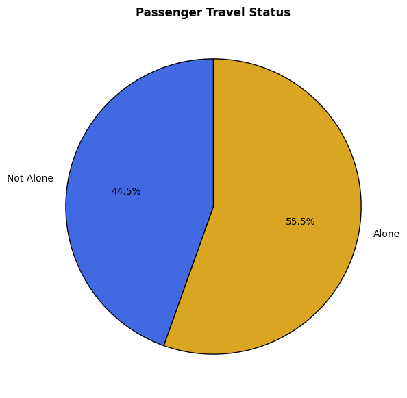

## Bivariate Analysis

### 1. **Passenger Class vs Survival**

Passengers in elite classes exhibited a significantly higher survival rate compared to those in 3rd class, suggesting that priority may have been given to elite passengers during the rescue operations.

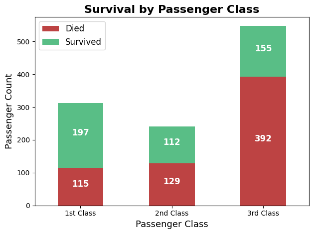
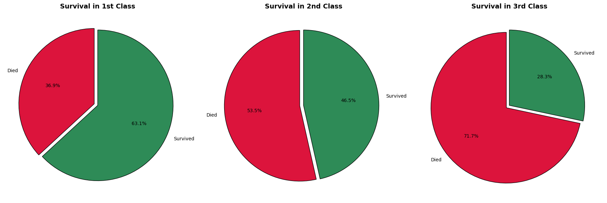

### 2. **Sex vs Survival**

Female passengers exhibited a significantly higher survival rate (73.4%) compared to male passengers (22.3%), indicating that rescue operations prioritized females.

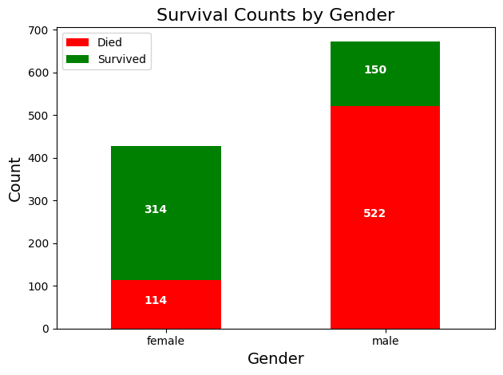
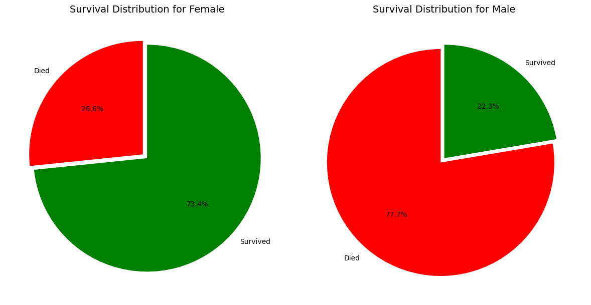

### 3. **Age vs Survival**

Children (0-20) and middle-aged (30-60) passengers experienced higher survival rates compared to young adults (20-30). Passengers aged 60 and above had the lowest survival rate, suggesting age may have influenced the priority of rescue efforts.

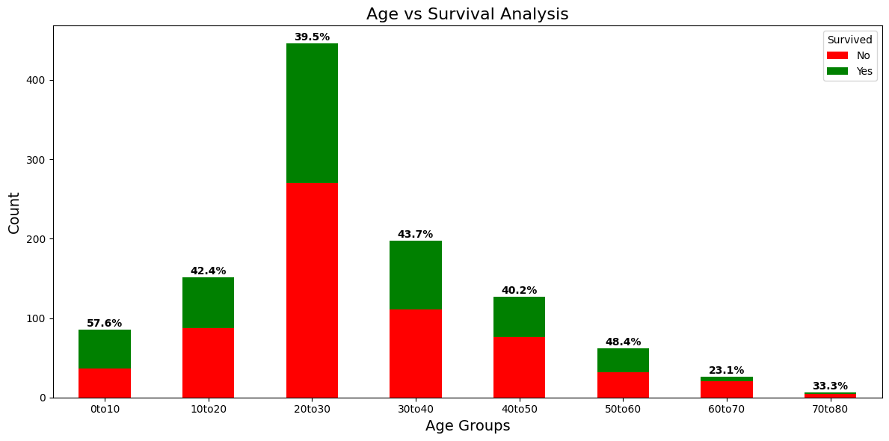

### 4. **Travelling Alone vs Survival**

Passengers accompanied by family had a survival rate of 51.4%, compared to only 34.8% for those travelling alone. This suggests that being accompanied by family may have improved survival chances.

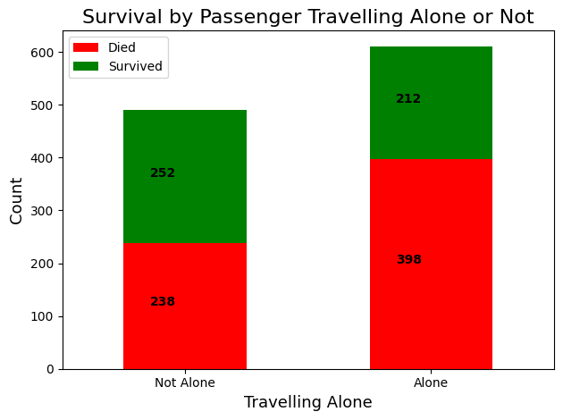
